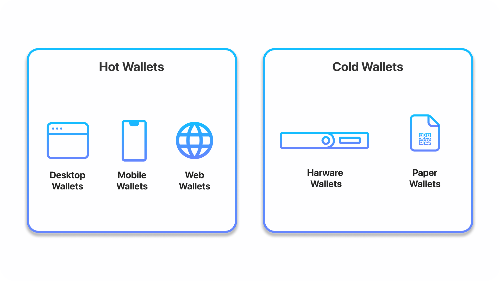

## Intro to Web3 Wallets

Just like how people have a physical wallet to store paper money, these wallets help store access to your digital currency instead. In addition, Web3 wallets are capable of storing digital assets such as NFTs and enable users to interact with Decentralized Apps (dApps). This is done all without the necessity of a middleman involved.

Wallets don’t actually store the cryptocurrency, but they store the information required for access to your funds which are digital cryptocurrencies.

A crypto wallet has three main components:

* Public Key: This links to an address where you can send and receive transactions.

* Private Key: Must be kept secret and undisclosed. This is used for signing new transactions and enables access to funds.

* Seed Phrase: Used to generate multiple private keys. Act as a root key, giving access to the rest of the keys and addresses in a user’s wallet. This can also create new private keys.

In Web3, several types of wallets exist within the space. Each has its favorable use cases and may be useful depending on your intention of managing your data and funds. It’s ideal to try and see which type of wallet works best for you.

## How do web3 wallets work?

When a user creates a web3 wallet, they are given a unique private key that is used to prove ownership of their digital assets. This private key is then used to generate a corresponding public key, which can be used to verify the authenticity of transactions. By using these keys together, a web3 wallet can enable digital identity and prove ownership of digital assets in a secure and decentralized way.

Web3 wallets also enable digital identity by providing users with a unique address, also known as a "public address", that can be used to receive digital assets. This address is derived from the public key and can be shared publicly, allowing others to send digital assets to the user's wallet. By providing a unique public address, a web3 wallet can enable digital identity and prove ownership of digital assets in a secure and decentralized way.

This public address can also be tied to a decentralized name service — making it easier for others to remember and interact with your wallet’s public key. For the Ethereum blockchain, for example, you can register an .eth domain to your wallet through the [Ethereum Name Service (ENS)](https://ens.domains/?ref=thirdweb). In this way, someone is able to send a digital asset to your wallet by “addressing” it to your .eth domain, rather than your public key — which is a string of randomized numbers and letters.

## What are the different types of web3 wallets?

Web3 wallets are not all built the same, and nowadays, there are more options than ever for users to access and interact with the blockchain depending on their needs.

To understand this further, let’s look at the different types of web3 wallets, what their use cases are, and why they’re important:

### Hot Wallets vs. Cold Wallets

#### Hot Wallets

Hot Wallets are generally referred to as software wallets because they are hosted on devices that have access to the internet and cryptocurrency network. They are more convenient than other types of wallets due to their ability to store, send, receive, and view tokens. Hot wallets are considered the highest in utility when it comes to Web3 wallets.

Since hot wallets are connected to the web, they’re open to more hacks compared to cold wallets.

##### Desktop Wallets

Desktop wallets simply are downloaded as an application to our laptop or desktop. That means it is executed locally in the machine. They are considered the safest type of hot wallets available.

##### Web Wallets

Web wallets are installed on someone else’s computer or server. It allows people to interact via a browser interface. Therefore, it isn’t necessary to download or install anything on a device.

##### Mobile Wallets

These are very similar and work much like desktop wallets, except are designed specifically as mobile apps for smartphones.

#### Cold Wallets

Cold wallets tend to be a safer alternative to store cryptocurrencies because of no connection to the internet. This is because there is a physical medium to store the keys offline. This method makes cold wallets increasingly resistant to hackers, which is known as cold storage. This is specifically useful for long-term investors.

##### Hardware Wallets

Hardware wallets are physical electronic devices (often resembling a USB device) that use a Random number generator (RNG) to generate public and private keys. This is considered one of the safest alternatives because of its ability to hold public and private keys in the device without any connection to the internet. Therefore, access to your cryptocurrencies will be offline. Using hardware wallets for cold storage enables users to have more security and prevents hackers from accessing their funds.

As such, hardware wallets are most suitable for long-term investing and storage because they tend to be less accessible. Its main use case is for ensuring a high amount of security for large sums of money not allocated for constant usage.

##### Paper Wallets

A paper wallet is a piece of paper consisting of which a blockchain address and private key are physically printed out. These keys are printed out as QR codes. People can send funds by scanning QR codes.

### Web3 Wallets on Centralized Exchange (CEX) vs. Decentralized Exchange (DEX)

Centralized and decentralized exchanges have operated in parallel and occupy an important role throughout digital currencies. Although Decentralized Exchanges have not had their popularity until recently, they have played an increasing role today. With the rise of Defi enabling a new breed of financial products, it’s crucial to know how wallets play a role within the ecosystem.

#### Standard Crypto Exchanges

Within an exchange, your wallet is likely to be a hot wallet and custodial for facilitating faster trades. A benefit is that it’s easier to access and trade seamlessly with the traditional username and password configuration. You also have the option to withdraw crypto using your exchange-hosted private keys.

However, that also means relying your assets on a centralized entity as they have control over your private keys. More reputable crypto exchanges store the majority of funds outside of transactions in cold hardware wallets to ensure these funds are secured and offline. Some exchanges go beyond and insure potential losses against hacks.

#### Decentralized Exchanges

Decentralized exchanges enable non-custodial wallets to be used. This allows the user to maintain full custody of your private keys and funds. Many people are shifting to a non-custodial wallet because it eliminates the need for a third-party intermediary. Being non-custodial mean that there are no limits or restrictions set by fees, withdrawals, and more.

### Smart Contract Wallets

Most conventional web3 wallets are Externally Owned Accounts (EOAs), meaning they are controlled by a private key (which you can think of as a password). Smart contract wallets, on the other hand, are built on top of smart contracts, which enables security functionality that EOA wallets do not have. This is made possible by a concept called [account abstraction](https://www.argent.xyz/blog/wtf-is-account-abstraction/?ref=thirdweb).

If a wallet is controlled by a smart contract, then it is programmed by that smart contract’s code. This makes it possible to program features into the wallet like social recovery, transfer limits, and account freezing for added usability and security.

One specific category of wallet that is enabled by smart contract wallets, and is growing in popularity, is multi-sig wallets — which are worth expanding on further as they have various use cases for companies and organizations, when more security is important.

### Multi-Sig (aka Multi-Signature) Wallets

Multisig wallets are smart contract wallets that require more than one signature to authorize a transaction, enabling added security for the funds or assets stored within a wallet. Multisig wallets are managed by trusted third parties — like friends, family, or coworkers — that need to approve a transaction for it to go through.

This makes it harder for a bad actor to hack the assets in your wallet, since they would need to have access to each party’s wallet address (or the majority, if the multisig wallet requires a majority amount of signatures).

Pros include an added layer of security, but cons include the need for multiple parties to sign off on transactions, which can slow down the process.

### MPC Wallets

Multi-Party Computation, or MPC, allows two or more parties to compute without revealing any private information to one another.

In web3, MPC wallets replace a wallet’s private key with multiple, independently-created “secret shares.” This allows a safe self-custodial option for users since you do not need to worry about losing your private key or seed phrase.

### Email Wallets

Email wallets are a subsection of custodial wallets, and they have gained significant traction recently due to the frictionless user onboarding and adoption that they enable for web3 products.

Email wallets allow users to sign up for, log into, and create web3 wallets using their email addresses — making it very easy for users to use blockchain-based apps without any prior crypto experience. Because of this, many companies opt for custodial email wallets, taking care of security and the blockchain complexity for users that are unfamiliar with, or do not have, a traditional web3 wallet.

### References
[The 15 Best Web3 Wallets for 2022](https://www.alchemy.com/web3-wallets-overview#web3-1)
[The Complete Guide to Web3 Wallets](https://blog.thirdweb.com/web3-wallet/)

## MetaMask Wallet

For desktop users, you may use Metamask, a web browser extension available  on Chrome, Firefox, Opera, and Brave browsers. Like Argent, Metamask is  a non-custodial wallet and acts as both a wallet and an interaction bridge for  the Ethereum network. It should be noted that Metamask also has an app  for mobile phones. However, the app may have difficulties interacting with  Dapps as some Dapps are not optimized for mobile devices.

You can store your Ethereum and ERC20 tokens on Metamask. Acting as  an interaction bridge, Metamask enables you to use all Decentralized  Applications (Dapps) hosted on the Ethereum Network.

Without the use of an interaction bridge like MetaMask, your browser would  not be able to access the Ethereum blockchain unless you were running a  full Ethereum node and had the entire Ethereum blockchain of over 400GB  downloaded on your computer. On a technical level, MetaMask does this by  injecting a javascript library known as web3.js written by the core Ethereum  developers into your browser’s page to enable you to interact with the  Ethereum network easily.

Metamask makes interaction with DeFi Dapps on the Ethereum network  very convenient on your laptop or PC. They are secured to some degree as  it requires you to sign each interaction and transaction you execute on the  network. Metamask also has an in-built token swap feature, which allows you  to exchange other tokens directly from the wallet.

However, it would be best if you took precautions to keep your Metamask  safe and secure. Anybody who has your password or seed phrase (a secret  phrase given to you during wallet sign-up) will have complete control of your  wallet.

### Metamask: Step-by-Step Guide

[How to use MetaMask: A step by step guide](https://levelup.gitconnected.com/how-to-use-metamask-a-step-by-step-guide-f380a3943fb1)

[Getting started with MetaMask](https://support.metamask.io/hc/en-us/articles/360015489531-Getting-started-with-MetaMask)

## Wallet Technologies

A common misconception about bitcoin is that bitcoin wallets contain bitcoin. In fact, the wallet contains only keys. The "coins" are recorded in the blockchain on the Bitcoin network. Users control the coins on the network by signing transactions with the keys in their wallets. In a sense, a bitcoin wallet is a keychain.

There are two primary types of wallets, distinguished by whether the keys they contain are related to each other or not.

* The first type is a nondeterministic wallet, where each key is independently generated from a random number. The keys are not related to each other. This type of wallet is also known as a JBOK wallet from the phrase "Just a Bunch Of Keys."

* The second type of wallet is a deterministic wallet, where all the keys are derived from a single master key, known as the seed. All the keys in this type of wallet are related to each other and can be generated again if one has the original seed. There are a number of different key derivation methods used in deterministic wallets. The most commonly used derivation method uses a tree-like structure and is known as a hierarchical deterministic or HD wallet.

    Deterministic wallets are initialized from a random sequence (entropy). To make these easier to use, random sequences are encoded as English words, also known as mnemonic code words.

### Deterministic (Seeded) Wallets

Deterministic, or "seeded," wallets are wallets that contain private keys that are all derived from a common seed, through the use of a one-way hash function. The seed is a randomly generated number that is combined with other data, such as an index number or "chain code" to derive the private keys. In a deterministic wallet, the seed is sufficient to recover all the derived keys, and therefore a single backup at creation time is sufficient. The seed is also sufficient for a wallet export or import, allowing for easy migration of all the user’s keys between different wallet implementations.

Type-1 deterministic (seeded) wallet: a deterministic sequence of keys derived from a seed shows a logical diagram of a deterministic wallet.

### HD Wallets (BIP-32/BIP-44)

Deterministic wallets were developed to make it easy to derive many keys from a single "seed". The most advanced form of deterministic wallets is the HD wallet defined by the BIP-32 standard. HD wallets contain keys derived in a tree structure, such that a parent key can derive a sequence of children keys, each of which can derive a sequence of grandchildren keys, and so on, to an infinite depth.

This tree structure is illustrated in Type-2 HD wallet: a tree of keys generated from a single seed.

HD wallets offer two major advantages over random (nondeterministic) keys. First, the tree structure can be used to express additional organizational meaning, such as when a specific branch of subkeys is used to receive incoming payments and a different branch is used to receive change from outgoing payments. Branches of keys can also be used in corporate settings, allocating different branches to departments, subsidiaries, specific functions, or accounting categories.

The second advantage of HD wallets is that users can create a sequence of public keys without having access to the corresponding private keys. This allows HD wallets to be used on an insecure server or in a receive-only capacity, issuing a different public key for each transaction. The public keys do not need to be preloaded or derived in advance, yet the server doesn’t have the private keys that can spend the funds.

### Seeds and Mnemonic Codes (BIP-39)

HD wallets are a very powerful mechanism for managing many keys and addresses. They are even more useful if they are combined with a standardized way of creating seeds from a sequence of English words that are easy to transcribe, export, and import across wallets. This is known as a mnemonic and the standard is defined by BIP-39. Today, most bitcoin wallets (as well as wallets for other cryptocurrencies) use this standard and can import and export seeds for backup and recovery using interoperable mnemonics.

### Creating an HD Wallet from the Seed

Every key in the HD wallet is deterministically derived from this root seed, which makes it possible to re-create the entire HD wallet from that seed in any compatible HD wallet. This makes it easy to back up, restore, export, and import HD wallets containing thousands or even millions of keys by simply transferring only the mnemonic that the root seed is derived from.

Creating master keys and chain code from a root seed

The root seed is input into the HMAC-SHA512 algorithm and the resulting hash is used to create a master private key (m) and a master chain code (c).

The master private key (m) then generates a corresponding master public key (M) using the normal elliptic curve multiplication process m * G that we saw in [pubkey].

#### Private child key derivation

HD wallets use a child key derivation (CKD) function to derive child keys from parent keys.

#### Using derived child keys

Child private keys are indistinguishable from nondeterministic (random) keys. Because the derivation function is a one-way function, the child key cannot be used to find the parent key. The child key also cannot be used to find any siblings. If you have the nth child, you cannot find its siblings, such as the n–1 child or the n+1 child, or any other children that are part of the sequence. Only the parent key and chain code can derive all the children. Without the child chain code, the child key cannot be used to derive any grandchildren either. You need both the child private key and the child chain code to start a new branch and derive grandchildren.

So what can the child private key be used for on its own? It can be used to make a public key and a Bitcoin address. Then, it can be used to sign transactions to spend anything paid to that address.

#### Public child key derivation

As mentioned previously, a very useful characteristic of HD wallets is the ability to derive public child keys from public parent keys, without having the private keys. This gives us two ways to derive a child public key: either from the child private key, or directly from the parent public key.

### Details

[Wallet Technology Details](https://github.com/bitcoinbook/bitcoinbook/blob/develop/ch05.asciidoc#wallet-technology-details)

## How cryptography is used cryptocurrency

Cryptocurrencies use cryptography for three main purposes; to secure transactions, to control the creation of additional units, and to verify the transfer of assets. To accomplish all of these things, cryptocurrencies rely on what is called “public key cryptography.”

[How Cryptography Is Used Cryptocurrency](https://www.worldcryptoindex.com/how-cryptography-is-used-cryptocurrency/)

## Mastering Bitcoin, Chapter 4. Keys, Addresses

[Mastering Bitcoin, 2nd Edition by Andreas M. Antonopoulos, Chapter 4. Keys, Addresses](https://www.oreilly.com/library/view/mastering-bitcoin-2nd/9781491954379/ch04.html)

## Differences between BTC and ETH wallet addresses

### BTC wallet addresses:

* Bitcoin wallet addresses have between 26 and 35 characters and consist of both letters and numbers. They start with either "1," "3," or "bc1." Here's an example of a Bitcoin address:
**1Lbcfr7sAHTD9CgdQo3HTMTkV8LK4ZnX71**

* With some cryptocurrencies, including Bitcoin, each address you generate is different. Previous addresses are still tied to your account and can be reused. 

### ETH wallet addresses:
* Ethereum addresses are 42-character hexadecimal addresses. They're generated using the last 20 bytes of the wallet's public key and by adding "0x" to the front. Here's an example of an Ethereum address:
**0x1ABC7154748D1CE5144478CDEB574AE244B939B5**

* With other cryptocurrencies, including Ethereum, wallet addresses don't change.