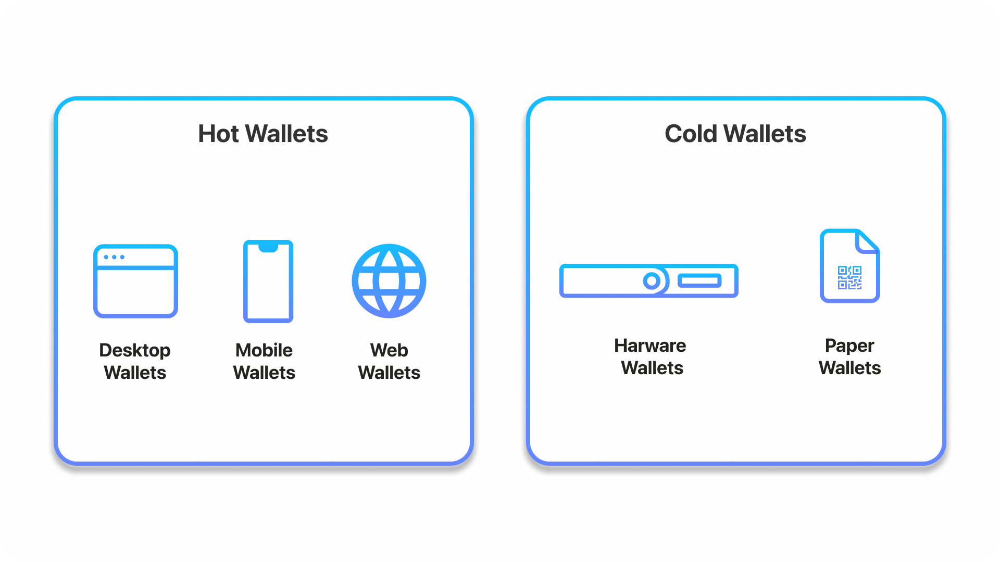

## Intro to Web3 Wallets

Just like how people have a physical wallet to store paper money, these wallets help store access to your digital currency instead. In addition, Web3 wallets are capable of storing digital assets such as NFTs and enable users to interact with Decentralized Apps (dApps). This is done all without the necessity of a middleman involved.

Wallets don’t actually store the cryptocurrency, but they store the information required for access to your funds which are digital cryptocurrencies.

A crypto wallet has three main components:

* Public Key: This links to an address where you can send and receive transactions.

* Private Key: Must be kept secret and undisclosed. This is used for signing new transactions and enables access to funds.

* Seed Phrase: Used to generate multiple private keys. Act as a root key, giving access to the rest of the keys and addresses in a user’s wallet. This can also create new private keys.

In Web3, several types of wallets exist within the space. Each has its favorable use cases and may be useful depending on your intention of managing your data and funds. It’s ideal to try and see which type of wallet works best for you. 

## Hot Wallets

Hot Wallets are generally referred to as software wallets because they are hosted on devices that have access to the internet and cryptocurrency network. They are more convenient than other types of wallets due to their ability to store, send, receive, and view tokens. Hot wallets are considered the highest in utility when it comes to Web3 wallets.

Since hot wallets are connected to the web, they’re open to more hacks compared to cold wallets.

#### Desktop Wallets

Desktop wallets simply are downloaded as an application to our laptop or desktop. That means it is executed locally in the machine. They are considered the safest type of hot wallets available.

#### Web Wallets

Web wallets are installed on someone else’s computer or server. It allows people to interact via a browser interface. Therefore, it isn’t necessary to download or install anything on a device. It consists of the exact same features as desktop wallets, using the same blockchains and block explorer to search blocks and transactions.

#### Mobile Wallets

These are very similar and work much like desktop wallets, except are designed specifically as mobile apps for smartphones.

This gives users access convenient access to their funds at the palm of their hands. Mobile wallets tend to be more primitive compared to desktop apps due to limited space and the use case for simplicity.

## Cold Wallets

Cold wallets tend to be a safer alternative to store cryptocurrencies because of no connection to the internet. This is because there is a physical medium to store the keys offline. This method makes cold wallets increasingly resistant to hackers, which is known as cold storage. This is specifically useful for long-term investors.

#### Hardware Wallets

Hardware wallets are physical electronic devices (often resembling a USB device) that use a Random number generator (RNG) to generate public and private keys. This is considered one of the safest alternatives because of its ability to hold public and private keys in the device without any connection to the internet. Therefore, access to your cryptocurrencies will be offline. Using hardware wallets for cold storage enables users to have more security and prevents hackers from accessing their funds.

As such, hardware wallets are most suitable for long-term investing and storage because they tend to be less accessible. Its main use case is for ensuring a high amount of security for large sums of money not allocated for constant usage.

#### Paper Wallets

A paper wallet is a piece of paper consisting of which a blockchain address and private key are physically printed out. These keys are printed out as QR codes. People can send funds by scanning QR codes.

Usage for paper wallets isn’t commonly used today and is often discouraged due to its fundamental flaws. One of these flaws is that paper wallets can’t send partial funds and can only send the entire balance all at once.

## Web3 Wallets on Centralized Exchange (CEX) vs. Decentralized Exchange (DEX)

Centralized and decentralized exchanges have operated in parallel and occupy an important role throughout digital currencies. Although Decentralized Exchanges have not had their popularity until recently, they have played an increasing role today. With the rise of Defi enabling a new breed of financial products, it’s crucial to know how wallets play a role within the ecosystem.

#### Standard Crypto Exchanges

Within an exchange, your wallet is likely to be a hot wallet and custodial for facilitating faster trades. A benefit is that it’s easier to access and trade seamlessly with the traditional username and password configuration. You also have the option to withdraw crypto using your exchange-hosted private keys.

However, that also means relying your assets on a centralized entity as they have control over your private keys. More reputable crypto exchanges store the majority of funds outside of transactions in cold hardware wallets to ensure these funds are secured and offline. Some exchanges go beyond and insure potential losses against hacks.

#### Decentralized Exchanges

Decentralized exchanges enable non-custodial wallets to be used. This allows the user to maintain full custody of your private keys and funds. Many people are shifting to a non-custodial wallet because it eliminates the need for a third-party intermediary. Being non-custodial mean that there are no limits or restrictions set by fees, withdrawals, and more.

Having no reliance on a third party means more responsibility for the user to manage their own keys and wallet. If you haven’t taken any precautions to regenerate your wallet, you could lose your funds.

